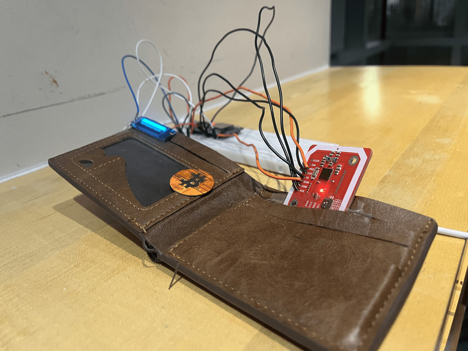

# Crypto You Can Hold

> **Physical crypto transfers that feel like handing someone a coin.**



No wallet addresses. No QR codes. No app accounts shared. Just tap and go.

[](LICENSE)
[]()
[]()
[]()
[]()

---

## What is this?

Crypto You Can Hold is an open-source proof-of-concept that bridges the gap between the tangibility of cash and the security of cryptocurrency. You assign value to a physical NFC coin from your phone, unlock a 2-minute transfer window, hand it over, and the recipient taps it against an ESP32-powered smart wallet. Transfer complete — no addresses, no accounts, no public ledger.

The key insight: **the coin stores nothing of value**. It only holds a `coin_id`. All ownership is tracked server-side, so a stolen or cloned coin is completely worthless.

An AI layer (Gemini 2.5 Flash) analyzes transaction history in real time and gives both parties a risk score before the transfer finalizes.

---

## How a Transfer Works

```
Alice (iPhone App)                Physical Coin          Bob (ESP32 Wallet)
      │                               │                         │
      │── Assigns 0.5 BTC to coin ───►│                         │
      │── Opens 120-sec window ──────►│                         │
      │                               │◄── Bob taps coin ───────│
      │◄── Pending transfer detected ─┤                         │
      │                               │                         │
      │ [AI Risk Overlay: Score 35 ✓] │                         │
      │── Confirms transfer ──────────┼────────────────────────►│
      │                               │   OLED: TRANSFER ✓      │
```

---

## Architecture

```
┌─────────────────────────────────────────────────────┐
│               iPhone App (SwiftUI)                   │
│  Manage balances · Assign coins · Authorize transfers │
└──────────────────────┬──────────────────────────────┘
                       │ REST (ngrok)
                       ▼
┌─────────────────────────────────────────────────────┐
│           Backend API (Jac + FastAPI)                │
│  Coin state · Wallet balances · Transfer windows     │
│  Gemini 2.5 Flash ──► AI risk scoring                │
│  db.json ──────────► Persistent store                │
└────────┬────────────────────────────────────────────┘
         │ REST (ngrok)
         ▼
┌─────────────────────────────────────────────────────┐
│         ESP32 Smart Wallet (Arduino C++)             │
│  PN532 NFC reader · SSD1306 OLED · WiFi             │
└──────────────────────▲──────────────────────────────┘
                       │ 13.56 MHz NFC
              ┌────────┴────────┐
              │  Cardboard Coin  │
              │  + NFC 215 Tag   │
              │  {"coin_id": …}  │
              └─────────────────┘
```

---

## Project Structure

```
CryptoYouCanHold/
├── Backend-API/
│   ├── main.jac          # All API endpoints + AI risk logic
│   ├── jac.toml          # Jac project config
│   └── db.json           # File-based data store (coins, wallets, history)
│
├── iOS_App_WalletBridge/
│   └── iOS_App_WalletBridge/
│       ├── ModelsAndState.swift       # Core ViewModel + API client
│       ├── ContentView.swift          # Root tab view + 3D coin
│       ├── WalletView.swift           # Balances, active coins, AI overlay
│       ├── CoinDetailView.swift       # Asset assignment flow
│       ├── HardwareControlView.swift  # Unlock / suspend / reclaim
│       └── SharedViews.swift          # Reusable UI components
│
├── ESP32/
│   └── main.ino           # Smart wallet firmware
│
└── assets/
    └── smart-wallet.svg   # Product diagram
```

---

## Tech Stack

| Layer | Technology | Key Libraries |
|-------|-----------|---------------|
| Backend | Jac + Python 3 | FastAPI, uvicorn |
| AI | Gemini 2.5 Flash | Jac `by llm()` |
| iOS | Swift + SwiftUI | Combine, SceneKit, URLSession |
| Hardware | C++ (Arduino) | Adafruit_PN532, Adafruit_SSD1306, ArduinoJson |
| Database | JSON | db.json (file-based) |
| Prices | CoinGecko API | Real-time BTC / ETH |
| Tunnel | ngrok | Public demo access |

---

## Getting Started

### Prerequisites

- Python 3.10+, [Jac](https://www.jac-lang.org/) installed
- Xcode 15+ (iOS 17 target)
- Arduino IDE + ESP32 board support
- ngrok account (free tier works)
- Gemini API key

---

### 1. Backend

```bash
cd Backend-API

# Install Jac
pip install jaclang

# Set your Gemini API key
export GEMINI_API_KEY=your_key_here

# Run the server
jac serve main.jac
```

Then expose it with ngrok:

```bash
ngrok http 8000
```

Copy the `https://…ngrok-free.app` URL — you'll need it for the app and firmware.

---

### 2. iOS App

1. Open `iOS_App_WalletBridge/iOS_App_WalletBridge.xcodeproj` in Xcode.
2. In `ModelsAndState.swift`, update the base URL constant to your ngrok URL:
   ```swift
   let baseURL = "https://your-ngrok-url.ngrok-free.app"
   ```
3. Connect a physical iPhone (NFC scanning requires real hardware).
4. Build and run (`Cmd+R`).

---

### 3. ESP32 Smart Wallet

**Hardware you need:**
- ESP32 development board
- Adafruit PN532 NFC/RFID module
- SSD1306 OLED display (0.92" or 0.96", I2C)

**Wiring:**

| Peripheral | Pin |
|-----------|-----|
| OLED SDA  | D21 |
| OLED SCL  | D22 |
| NFC SCK   | D18 |
| NFC MISO  | D19 |
| NFC MOSI  | D23 |
| NFC SS    | D5  |

**Firmware setup:**

1. Install board: Arduino IDE → Boards Manager → `esp32` by Espressif.
2. Install libraries: `Adafruit_PN532`, `Adafruit_SSD1306`, `ArduinoJson`.
3. Open `ESP32/main.ino`.
4. Update the constants at the top of the file:
   ```cpp
   const char* ssid     = "YourHotspot";
   const char* password = "YourPassword";
   const char* apiBase  = "https://your-ngrok-url.ngrok-free.app";
   ```
5. Flash to the board.

---

### 4. Physical Coin

Cut any stiff material (cardboard, thin plastic) into a coin shape. Write the following JSON to an NFC 215 tag as a plain NDEF text record and attach it to the coin:

```json
{"coin_id": "your-unique-id"}
```

Apps like **NFC Tools** (iOS/Android) can write NDEF records to blank tags.

---

## API Reference

| Method | Endpoint | Description |
|--------|----------|-------------|
| `POST` | `/coins/` | Create coin, lock value from wallet |
| `GET` | `/coins/{coin_id}` | Get coin state |
| `GET` | `/coins/wallet/{wallet_id}` | List coins owned by wallet |
| `PUT` | `/coins/{coin_id}/transfer_mode` | Open 120-sec transfer window |
| `POST` | `/coins/tap` | Hardware tap — initiate transfer |
| `POST` | `/coins/transfer/confirm` | Owner authorizes transfer |
| `POST` | `/coins/transfer/cancel` | Owner cancels transfer |
| `GET` | `/wallets/{wallet_id}/risk` | AI risk assessment |
| `DELETE` | `/coins/{coin_id}` | Destroy coin, refund balance |

---

## Security Model

- The physical coin contains **no keys, no balance, no sensitive data** — only a `coin_id`.
- Cloning the NFC tag or stealing the coin is useless without an active transfer window.
- Transfer windows are **120 seconds, single-use**, and tied to the owner's session.
- AI fraud detection runs on every transfer using transaction history.

---

## Contributing

Contributions are welcome. This was built as a hackathon prototype — there's a lot of room to grow.

**Good first issues:**
- Replace `db.json` with a real database (SQLite or PostgreSQL)
- Add multi-asset support beyond BTC/ETH
- Implement proper auth (JWT) instead of wallet ID strings
- Add Android app support
- Add unit tests for backend endpoints
- Improve ESP32 error handling and WiFi reconnection logic

**How to contribute:**

1. Fork the repository
2. Create a branch: `git checkout -b feature/your-feature`
3. Make your changes and commit: `git commit -m "add: short description"`
4. Push and open a Pull Request

Please keep PRs focused — one feature or fix per PR makes review much faster.

---

## License

MIT — see [LICENSE](LICENSE). Do whatever you want with it.

---

## Inspiration

> *"What if crypto transactions felt like handing someone a coin?"*

Cash has something crypto never achieved: it's physical, instant, private, and requires no infrastructure at the point of exchange. Crypto You Can Hold is an experiment in what it would look like to give crypto those same properties — while adding a security layer (fraud detection) that neither cash nor crypto currently has.

Built at a hackathon. Proof of concept only — not production ready.
